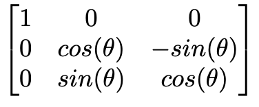
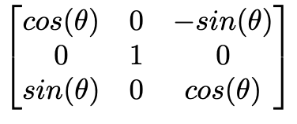
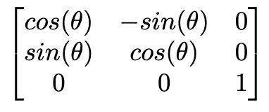

# Spacial Rotation

Rotate a cube in a **3D space** over all **3 axes - X, Y, Z**. This program can be used to visualize the effect of **matrix multiplication and matrix transformation**, in this case **rotation**.


## Installation & Usage
Download the Racket programming language `version 7.4` and IDE through this [Link](https://download.racket-lang.org).

You can start the program in two ways:
##### Command Line (UNIX)
Create a symlink to the `racket` command by running
```
ln -sf "/Applications/Racket v6.2.1/bin/racket" /usr/local/bin/racket
```
Then, access the path where your space rotation simulation file is stored and run
```
racket spacial-rotation.rkt
```

##### IDE
You can open the desired fractal simulation file on the **DrRacket IDE** and press the run button.

#### Usage
After starting up the program, you can use your **keyboard arrows** and keys **b** and **n** to rotate the cube in the space.
* Rotation over **X-axis** (Horizontal): ⬅️ ➡️.
* Rotation over **Y-axis** (Vertical): ⬆️ ⬇️.
* Rotation over **Z-axis** (Diagonal): `b` `n`

To exit, simply close the GUI window.

## Implementation Details
The position of the cube is updated by applying **Matrix Transformation** to the vector coordinates of each line forming the cube. Each axis has a corresponding matrix with leaves the coordinate of a line on that axis unchanged during the rotation. Below are the transformation applied on each axis.

* **Rotation matrx over X-axis:** , where **θ** is the angle of the rotation.

* **Rotation matrx over Y-axis:** , where **θ** is the angle of the rotation.

* **Rotation matrx over Z-axis:** , where **θ** is the angle of the rotation.
